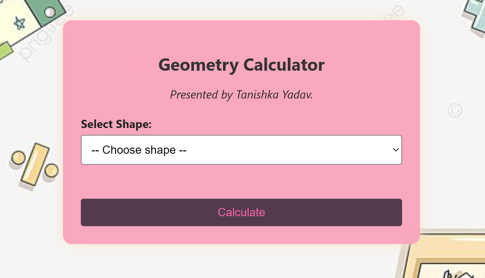

# Geometry Calculator

### Live Demo: [https://tanishka-cs.github.io/geometry-calculator/](https://tanishka-cs.github.io/geometry-calculator/)

[](https://tanishka-cs.github.io/geometry-calculator/)

## Overview

This is a simple, interactive web-based Geometry Calculator designed to help users quickly compute properties for various shapes. Built with foundational web technologies, it provides instant results based on user input.

## Features

* **Shape Selection:** Easily choose between different geometric shapes (e.g., Circle, Square, Triangle - *adapt based on what your calculator actually does*).
* **Property Calculation:** Calculates key properties like Area and Perimeter for the selected shape.
* **User-Friendly Interface:** Clean and intuitive design for ease of use.
* **Instant Results:** Provides immediate calculations as input is entered.

## Technologies Used

* HTML5: For structuring the web page content.
* CSS3: For styling and ensuring a responsive, visually appealing layout.
* JavaScript (ES6+): For all dynamic calculations, user interaction handling, and DOM manipulation.

## How to Use

1.  **Visit the Live Demo:** The easiest way is to use the live demo link provided above.
2.  **Select a Shape:** Choose the desired geometric shape from the dropdown menu.
3.  **Enter Dimensions:** Input the required dimensions (e.g., radius for a circle, side for a square, base and height for a triangle).
4.  **Get Results:** The calculated area and/or perimeter will be displayed instantly.

### Running Locally

If you wish to run this project on your local machine:

1.  **Clone the repository:**

    ````bash
    git clone [https://github.com/Tanishka-cs/geometry-calculator.git](https://github.com/Tanishka-cs/geometry-calculator.git)
    ````

2.  **Navigate to the project directory:**

    ````bash
    cd geometry-calculator
    ````

3.  **Open the file:**

    Open the `index.html` file directly in your preferred web browser.

## What I Learned / Key Takeaways

* **Front-End Development Fundamentals:** Solidified understanding of HTML structure, CSS styling, and JavaScript logic.
* **DOM Manipulation:** Gained practical experience in interacting with HTML elements dynamically using JavaScript to update content based on user input.
* **Event Handling:** Implemented various event listeners to capture user actions (e.g., shape selection, input changes, button clicks).
* **Algorithmic Thinking:** Applied basic mathematical formulas for geometric calculations within JavaScript functions.
* **Git & GitHub Pages:** Practiced version control with Git and successfully deployed a web project using GitHub Pages.

## Future Enhancements (Optional - ideas for later)

* Add more complex shapes (e.g., trapezoid, parallelogram, ellipse).
* Implement input validation to ensure only valid numerical inputs are accepted.
* Include visual representations of shapes.
* Add unit conversions.

## Author

**Tanishka Yadav**

* [LinkedIn Profile](https://www.linkedin.com/in/tanishka-yadav-5b5021366)
* [GitHub Profile](https://github.com/Tanishka-cs)

---

